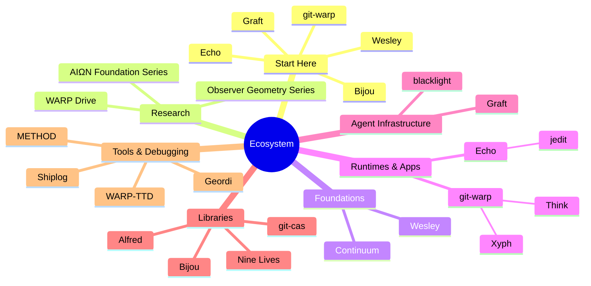

> I build deterministic developer infrastructure: schema compilers, Git-native provenance systems, replayable runtimes, terminal UI tooling, and agent-safe repo context systems. Most of the work is Rust and TypeScript.
> 
# My Work

For decades, most systems have quietly inherited the Unix mental model: processes mutating files on a shared, hierarchical filesystem. State lives in place. Logs are best-effort. History is whatever you remembered to write to disk.

That model scales surprisingly far, but it shows its limits under concurrency, distribution, and automation. Process-local mutation and ad hoc logging make it hard to answer basic questions: What actually happened? Who did it? In what order? Can we replay it?

The work here is an experiment in a post‑Unix posture:

- **Processes** become strands in a shared causal history, not anonymous workers scribbling over state.  
- **Files** become materializations over history, not the source of truth.  
- **The data model** is an append-only ledger of events with verifiable provenance, not mutable bytes at paths.  
- **Time** is encoded in the causal structure of that ledger—links, worldlines, ticks, receipts—not in loose timestamps.  
- **Runtimes** own admission, ordering, and replay; applications submit intents and consume evidence.  

You don’t fix a bug by guessing from logs—you derive it from the causal record. You don’t pray your editor and planner are in sync—you ask what the underlying history allows them to see.

The repositories below are materializations of this stack.

***

## How the pieces fit

- **Continuum** defines the shared causal-history protocol.
- **Wesley** compiles schemas and contracts into code, plans, and runtime artifacts.
- **Echo** and **git-warp** are sibling runtimes over deterministic, replayable history.
- **Bijou**, **Graft**, **Think**, **Xyph**, and **jedit** are applications or interfaces built around that model.
- **Alfred**, **Nine Lives**, and **git-cas** provide supporting resilience and storage infrastructure.

## Foundations

**[Continuum](https://github.com/flyingrobots/continuum)** — Shared protocol and contract language for witnessed causal history. The coordination layer that keeps sibling runtimes compatible without forcing them to share a database.

**[Wesley](https://github.com/flyingrobots/wesley)** — GraphQL SDL compiler. One schema drives TypeScript, Rust, SQL, manifests, and runtime plans. Proven semantics, zero hand-maintained drift.

**[METHOD](https://github.com/flyingrobots/method)** — Lightweight engineering process framework backed by the filesystem. Backlog, cycle loop, retros, drift detection — no sprint theater.

---

## Storage & history

**[git-warp](https://github.com/git-stunts/git-warp)** — Git-native causal history engine. Patches over worldlines, speculative strands, canonical braids. Git's distribution model plus structured, replayable provenance.

**[git-cas](https://github.com/git-stunts/git-cas)** — Industrial-grade content-addressable storage inside Git's object database. Chunked, deduplicated, AES-256-GCM encrypted. No external artifact host required.

**[Shiplog](https://github.com/flyingrobots/shiplog)** — Git-native deployment ledger. Signed, append-only deployment runs recorded inside Git refs. Every deploy step permanent, queryable, and reviewable.

**[Xyph](https://github.com/flyingrobots/xyph)** — Planning compiler built on git-warp. Replaces scattered tickets with a single deterministic WARP graph. Cryptographic settlement, Ed25519 guild seals, offline-first.

**[Think](https://github.com/flyingrobots/think)** — Instant thought-capture engine. Raw ideas into a private Git-backed cognitive worldline. Capture speed over organization; browse and reflect later.

---

## Runtimes & reliability

**[Echo](https://github.com/flyingrobots/echo)** — Deterministic runtime where state is a materialized view over immutable causal history. 300k+ rewrites/second at 60fps. Replay, time-travel, and provable transitions built in.

**[Alfred](https://github.com/git-stunts/alfred)** — Policy engine for async resilience in TypeScript. Composable, testable retry/backoff/circuit behavior with a live control plane.

**[Nine Lives](https://github.com/flyingrobots/ninelives)** — Tower-native resilience framework for Rust. Algebraic composition of retry, timeout, circuit breaker, bulkhead, and fallback — plus runtime policy control.

---

## Interfaces & products

**[Bijou](https://github.com/flyingrobots/bijou)** — TypeScript toolkit for terminal software. Real character grid, layout engine, i18n, deterministic render output. Terminal as a serious application platform.

**[Geordi](https://github.com/flyingrobots/geordi)** — Deterministic GPU scene IR for interactive vector UI. Canonical intermediate representation between authoring tools and WebGL/WebGPU/Metal/Vulkan backends.

**[Graft](https://github.com/flyingrobots/graft)** — Context governor for coding agents. Policy-enforced reads, parser-backed structural views, causal provenance over repo activity. Agents see the smallest safe view.

**[jedit](https://github.com/flyingrobots/jedit)** — Terminal-first text and Markdown editor over Echo and Graft. Vim-shaped. Edits are contract-shaped intents submitted to a causal runtime.

---

## Debugging & observation

**[WARP TTD](https://github.com/flyingrobots/warp-ttd)** — Time-travel debugger for deterministic causal runtimes. Inspect worldlines, receipts, rejected counterfactuals, and provenance. Pause, step, seek, fork.
