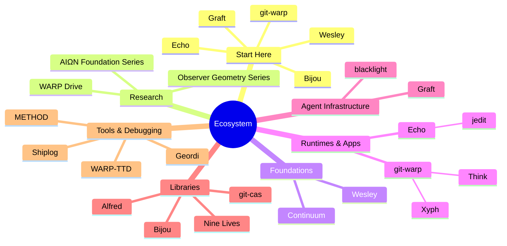

I build deterministic developer infrastructure: schema compilers, Git-native provenance systems, replayable runtimes, terminal UI tooling, and agent-safe repo context systems. Most of the work is Rust and TypeScript.

The common thread: **software history should be explicit, replayable, and inspectable.**

## Start Here

- **[Bijou](https://github.com/flyingrobots/bijou)** — Runnable terminal UI toolkit. Real character grid, layout engine, i18n, deterministic render output.
- **[Wesley](https://github.com/flyingrobots/wesley)** — GraphQL SDL compiler. One schema drives TypeScript, Rust, SQL, manifests, and runtime plans.
- **[Graft](https://github.com/flyingrobots/graft)** — Context governor for coding agents. Policy-enforced repo reads and structural views.
- **[Echo](https://github.com/flyingrobots/echo)** — Deterministic application runtime where state is a materialized view over causal history.
- **[git-warp](https://github.com/git-stunts/git-warp)** — Git-native causal history engine for replayable provenance, speculative branches, and canonical history.

## My Work

## Thesis

Most developer systems still inherit the Unix model: processes mutate files, logs are best-effort, and history is whatever someone remembered to record.

That model scales surprisingly far, but it breaks down under concurrency, distribution, and automation. Once humans, services, and agents are all changing state, the basic questions become hard:

- What actually happened?
- Who or what caused it?
- What did each actor see?
- Can we replay, fork, or verify the result?

This work explores a post-Unix runtime model:

- **Processes** become named actors in a shared causal history.
- **Files** become materialized views over history, not the source of truth.
- **State changes** become append-only events with verifiable provenance.
- **Time** is represented by causal structure, not loose wall-clock timestamps.
- **Runtimes** own admission, ordering, and replay; applications submit intents and consume evidence.

The goal is systems that remember what happened well enough to replay it, not better logs. Don’t hope your editor, planner, and agents are in sync; ask what the shared history allows each of them to see.

## How the Pieces Fit

- **Continuum** defines the shared causal-history protocol.
- **Wesley** compiles schemas and contracts into code, plans, and runtime artifacts.
- **Echo** and **git-warp** are sibling runtimes over deterministic, replayable history.
- **Graft** and **blacklight** are the agent-infrastructure layer.
- **Bijou**, **jedit**, **Think**, and **Xyph** are interfaces and applications built around the model.
- **Alfred**, **Nine Lives**, and **git-cas** provide supporting resilience and storage infrastructure.
- **WARP-TTD**, **Shiplog**, **Geordi**, and **METHOD** are tools for debugging, deployment, UI IR, and engineering process.

## Projects

### Foundations

| Project | Description |
| :--- | :--- |
| **[Continuum](https://github.com/flyingrobots/continuum)** | Shared protocol and contract language for witnessed causal history. The coordination layer that keeps sibling runtimes compatible without forcing them to share a database. |
| **[Wesley](https://github.com/flyingrobots/wesley)** | GraphQL SDL compiler. One schema drives TypeScript, Rust, SQL, manifests, and runtime plans. Schema semantics without hand-maintained drift. |

### Runtimes & Apps

| Project | Description |
| :--- | :--- |
| **[Echo](https://github.com/flyingrobots/echo)** | Deterministic runtime where state is a materialized view over immutable causal history. Replay, time-travel, and provable transitions built in. |
| **[git-warp](https://github.com/git-stunts/git-warp)** | Git-native causal history engine. Patches over worldlines, speculative strands, and canonical history. Git's distribution model plus structured, replayable provenance. |
| **[jedit](https://github.com/flyingrobots/jedit)** | Terminal-first text and Markdown editor over Echo and Graft. Vim-shaped. Edits are contract-shaped intents submitted to a causal runtime. |
| **[Think](https://github.com/flyingrobots/think)** | Fast thought-capture engine. Raw ideas into a private Git-backed cognitive worldline. Capture first; organize and reflect later. |
| **[Xyph](https://github.com/flyingrobots/xyph)** | Planning compiler built on git-warp. Turns plans, tasks, and coordination state into deterministic WARP graphs. Offline-first and provenance-aware. |

### Agent Infrastructure

| Project | Description |
| :--- | :--- |
| **[Graft](https://github.com/flyingrobots/graft)** | Context governor for coding agents. Policy-enforced reads, parser-backed structural views, and causal provenance over repo activity. Agents see the smallest safe view. |
| **[blacklight](https://github.com/flyingrobots/blacklight)** | Agent-observation and inspection infrastructure. |

### Libraries

| Project | Description |
| :--- | :--- |
| **[Bijou](https://github.com/flyingrobots/bijou)** | TypeScript toolkit for terminal software. Real character grid, layout engine, i18n, deterministic render output. Terminal as a serious application platform. |
| **[Alfred](https://github.com/git-stunts/alfred)** | Policy engine for async resilience in TypeScript. Composable retry, backoff, circuit behavior, fallback behavior, and runtime policy control. |
| **[Nine Lives](https://github.com/flyingrobots/ninelives)** | Tower-native resilience framework for Rust. Algebraic composition of retry, timeout, circuit breaker, bulkhead, and fallback policies. |
| **[git-cas](https://github.com/git-stunts/git-cas)** | Content-addressable storage inside Git's object database. Chunked, deduplicated, AES-256-GCM encrypted. No external artifact host required. |

### Tools & Debugging

| Project | Description |
| :--- | :--- |
| **[WARP-TTD](https://github.com/flyingrobots/warp-ttd)** | Time-travel debugger for deterministic causal runtimes. Inspect worldlines, receipts, rejected counterfactuals, and provenance. Pause, step, seek, fork. |
| **[Geordi](https://github.com/flyingrobots/geordi)** | Deterministic GPU scene IR for interactive vector UI. Canonical intermediate representation between authoring tools and WebGL/WebGPU/Metal/Vulkan backends. |
| **[Shiplog](https://github.com/flyingrobots/shiplog)** | Git-native deployment ledger. Signed, append-only deployment runs recorded inside Git refs. Every deploy step permanent, queryable, and reviewable. |
| **[METHOD](https://github.com/flyingrobots/method)** | Lightweight engineering process framework backed by the filesystem. Backlog, cycle loop, retros, drift detection — no sprint theater. |

## Research & Theory

The implementation work is backed by a formal research layer.

- **AIΩN Foundation Series** defines the core WARP model: WARP graphs, deterministic state evolution, computational holography, provenance payloads, observer-relative dynamics, and replay ethics.
- **Observer Geometry Series** formalizes how bounded observers see, compare, and justify claims over shared causal history.
- **Governance & Ethics** explores rights, safety, and accountability for systems whose histories can be replayed, inspected, or forked.

Paper index

### AIΩN Foundation Series

| Paper | DOI |
| :--- | :--- |
| **WARP Graphs: A Worldline Algebra for Recursive Provenance** | [`10.5281/zenodo.17908005`](https://doi.org/10.5281/zenodo.17908005) |
| **WARP Graphs: Canonical State Evolution and Deterministic Worldlines** | [`10.5281/zenodo.17934512`](https://doi.org/10.5281/zenodo.17934512) |
| **WARP Graphs: Computational Holography & Provenance Payloads** | [`10.5281/zenodo.17963669`](https://doi.org/10.5281/zenodo.17963669) |
| **WARP Graphs: Rulial Distance & Observer Geometry** | [`10.5281/zenodo.18038297`](https://doi.org/10.5281/zenodo.18038297) |
| **WARP Graphs: Emergent Dynamics from Deterministic Rewrite Systems** | [`10.5281/zenodo.18146884`](https://doi.org/10.5281/zenodo.18146884) |
| **WARP Graphs: Ethics of Deterministic Replay & Provenance Sovereignty** | [`10.5281/zenodo.18863648`](https://doi.org/10.5281/zenodo.18863648) |
| **WARP: Optics, Holograms, and Worldlines over Shared Causal History** | [`10.5281/zenodo.19751149`](https://doi.org/10.5281/zenodo.19751149) |

### Observer Geometry Series

| Paper | DOI |
| :--- | :--- |
| **Observer Geometry I** | [`10.5281/zenodo.18868896`](https://doi.org/10.5281/zenodo.18868896) |
| **Observer Geometry II: Distributed Observer Fields** | [`10.5281/zenodo.19873664`](https://doi.org/10.5281/zenodo.19873664) |
| **Observer Geometry III: Path Geometry and Support Obligations** | [`10.5281/zenodo.20046284`](https://doi.org/10.5281/zenodo.20046284) |

### Governance & Ethics

| Paper | DOI |
| :--- | :--- |
| **PRAXIS** | [`10.5281/zenodo.18206427`](https://doi.org/10.5281/zenodo.18206427) |
| **The Open Charter** | [`10.5281/zenodo.18517806`](https://doi.org/10.5281/zenodo.18517806) |

